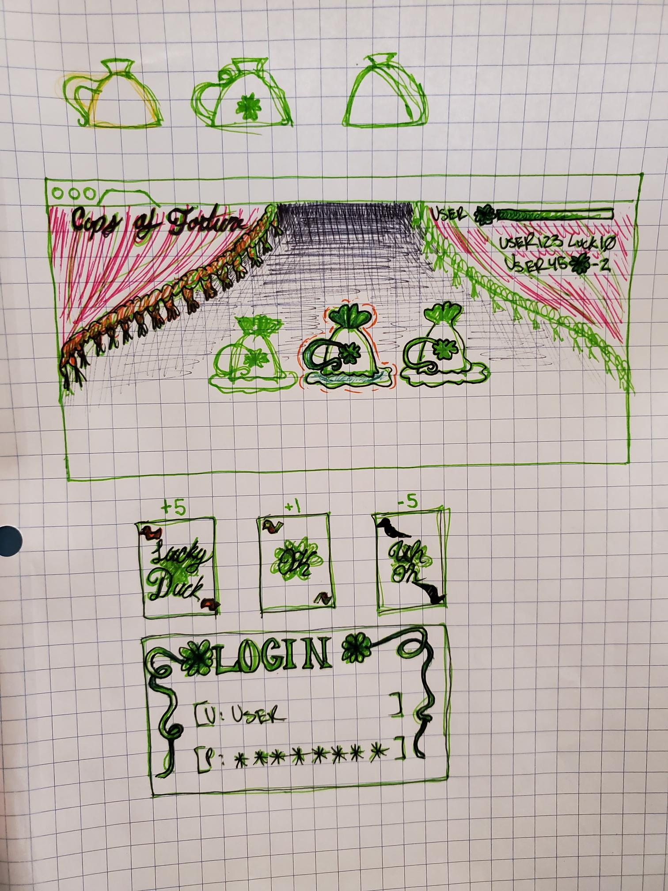

# startup

## Cups of Fortune

## Specification Deliverable

### Elevator Pitch

Are you wanting to test your odds? Missing carnival games? Or just bored and looking for a new game? Cups of Fortune is a simple game that will cure all three ailments. Once logged in a member will be given the chance to pick a cup and see what fortune they get. Once a cup is chosen a fortune will be revealed. This fortune can range from Good Luck, Mediocre Luck, to Bad Luck. Which doesn't change much.

...unless you believe in superstitions?

### Design

### Key Features
+ Login Screen to keep track of Luck Meters
+ Three Cups to choose from
+ Luck Meter, keeps track of user's luck

### Technologies
+ HTML 
  - Structure of Website

+ CSS 
  - Create polished look
  - Colors
  - Movement
  - Beautifier

+ JavaScript 
  - Allows interaction
  - Making it a fun game instead of a pretty picture 
  - Let's users pick a cup

+ React 
  - Side effects of users' actions
  - what happens after a user interacts with website

+ Web Service 
  + Keeps Account Info:
    + Username & Password
    + Accessing Lucky Meter
    + Saving updated Luck Points
    
+ Authentication
  - Prompt's login
  - Displays Users' names

+ WebSocket 
  - Allows users to interact with each other
  - Share Lucky Meters?
  - Exchange Luck?

## HTML Deliveraable

## CSS Deliverable

## React Delverable

## Service Deliverable

## DB/Login Deliverble

## WebSocket Deliverable

Startup BYU CS260
[Note Paper](docs/notes.md)
